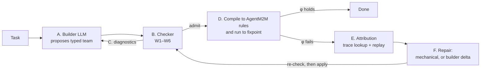

# AutoM2M

**Checked composition for automatically assembled LLM agent teams.**

Team builders (CaptainAgent, AutoAgents, MetaAgent, …) design a team of LLM agents for each task. The
teams they produce describe every agent with an English job description and pass free text between
agents, so nothing checks that the parts fit together before the team runs, and when the team fails
nobody can say which part was to blame. We call this the **composition gap**.

AutoM2M closes it in three steps:

1. The builder LLM must hand over a **typed team**: the forms each agent fills in, the hand-off rules
   between forms, the validators, and the goal, all in a fixed JSON format.
2. A deterministic **checker** decides, from the JSON alone, whether the team may run (six conditions,
   W1–W6).
3. The admitted team runs on the [AgentM2M](#relation-to-agentm2m) engine. If "done" does not hold,
   trace records point to the exact value that failed, the fault is classified, and a repair is
   applied only after the same checker has approved it.

> **Status: research prototype.** AutoM2M currently handles Python coding tasks only (ClassEval /
> HumanEval+ style: implement the methods of one class or one function). It is a library and
> experiment harness; it is **not** yet reachable from the Claude Code plugin. Experimental results
> are preliminary — see [Results so far](#results-so-far).

---

## How it works

AgentM2M's idea is *an LLM writes values; the engine owns structure*. AutoM2M applies the same split
one level higher: *an LLM proposes the team; a checker owns the decision to admit it.*



| Step | What happens | Code |
|---|---|---|
| A | The builder LLM writes a typed team in a fixed JSON format. | [`auto/prompts.py`](src/agentm2m/auto/prompts.py), [`auto/loop.py`](src/agentm2m/auto/loop.py) |
| B | The checker tests W1–W6 on the JSON: no task data, no LLM, no execution. | [`auto/checker.py`](src/agentm2m/auto/checker.py) |
| C | Violations go back to the builder as exact diagnostics, for up to `k_adm` rounds. | `AutoM2M.solve` |
| D | The team is compiled to ordinary AgentM2M rule files and metamodels and run by the unchanged runtime. The engine evaluates "done" (φ = `cover(G) ∧ valid ∧ fresh ∧ noObl`). | [`auto/compile.py`](src/agentm2m/auto/compile.py) |
| E | Each failed φ clause is traced to one value of one rule of one agent, then classified by cheap replays (validator, sampling, footprint, upstream or specification fault). | [`auto/attribution.py`](src/agentm2m/auto/attribution.py) |
| F | Mechanical fixes where possible (retry, widen footprint, redo upstream value); otherwise the builder proposes a revised team, which must pass the checker before it is applied in place, as a hot addition, or by rebuilding. | [`auto/repair.py`](src/agentm2m/auto/repair.py) |

### The six admission conditions

Each condition rules out one kind of composition defect (D1–D5).

| Condition | Plain meaning | Rules out |
|---|---|---|
| **W1** well typed | Rules read only their source forms and write only existing fields; every footprint path exists; every LLM value has a known, correctly typed validator. | D2 "lost in hand-off" |
| **W2** one writer | Each form has exactly one owning agent; each kind of object is created by exactly one rule. | D3 "too many cooks" |
| **W3** complete | Every mandatory field is filled; every reference points to something some rule creates. | D2 (content) |
| **W4** anchored coverage | Every goal flows, through footprints or validator inputs, into a value checked by a *behavioural* validator; every form lies on such a flow. | D1 "nobody owns it" |
| **W5** engine decides "done" | φ is exactly `cover(G) ∧ valid ∧ fresh ∧ noObl`; no "the Tester says so" clauses; no cycles between forms. | D4 "done because someone said so" |
| **W6** right tools | An agent that owns an LLM value has every tool its validators need (today only `exec`). | D5 "wrong person for the job" |

---

## Quick start

Requires Python ≥ 3.11 and, for anything that calls an LLM, a local [Ollama](https://ollama.com)
server.

```bash
python -m venv .venv && source .venv/bin/activate
pip install -e ".[dev,eval]"
cp .env.example .env          # pick the LLM backend; see the comments in the file

pytest tests plugin/tests     # 91 passed, 3 skipped
```

### Check a typed team (no LLM needed)

```bash
python -m agentm2m.auto.checker teams/devteam_proposal.json          # anchored W4 (default)
python -m agentm2m.auto.checker teams/devteam_proposal.json --naive  # class-level W4, for comparison
```

The seeded proposal contains one instance of each defect, and the checker reports exactly those:

```
W1  Op2Edit.body: footprint path 'op.returnType': Arch!Operation has no feature 'returnType' (...)
W2  view Test written by ['Developer', 'Tester']; needs exactly one writer
W4  goal obligation (Criterion, c.story.status = 'accepted'): no behavioural validator reads data derived from Criterion
W5  done-clause Tester.says('ALL TESTS PASS') is not engine-checkable
W6  Edit2TestRun.verdict needs ['exec']; owner Tester has []
REJECTED: 5 violation(s)
```

### Solve a task end to end

```python
from agentm2m.auto.loop import AutoM2M
from agentm2m.llm.metered import MeteredBackend
from agentm2m.llm.ollama_backend import OllamaBackend
from evaluation.benchmarks import tasks as T
from evaluation.harness.workbench import TaskWorkbench

task = T.load("classeval")[0]
llm = MeteredBackend(OllamaBackend("http://localhost:11434", "qwen2.5-coder:7b", num_ctx=16384),
                     budget_out=24000)
out = AutoM2M(llm).solve(task, task.prompt, TaskWorkbench(task))
print(out.status, out.admission_rounds, list(out.deliverables))
```

`out` is an `AutoOutcome` with the status (`done`, `failed`, `not_admitted`, `compile_error`), the
deliverables, the first and final team, every diagnostic, fault report and repair, and timing.
`llm.by_role()` breaks token use down by pipeline step (builder, binding, attribution, …).

Every backend now accepts `generate(format=..., system=..., max_tokens=...)`, so the builder also
runs on Anthropic and OpenAI. The multi-turn baselines in `evaluation/` still need Ollama's `chat()`.

### Drive it step by step (host mode: Claude, or you, is the builder)

`agentm2m auto` keeps an AutoM2M session in `.agentm2m/auto/` (task, admitted team, run state,
history), so the loop can be driven step by step and resumed:

```bash
agentm2m auto task calculator.py           # a class with stub methods (docstrings with >>> examples), or a stub function
agentm2m auto propose --prompt-only        # the builder prompt; answer it with a typed-team JSON
agentm2m auto submit team.json             # W1-W6: admitted, or rejected with diagnostics (propose then gives a revise prompt)
agentm2m auto run                          # fixpoint + phi; open values are pending
agentm2m auto bindings                     # footprint-bounded prompts to answer
agentm2m auto fill <target_key> <binding> answer.txt <footprint_version>
agentm2m auto status --brief               # phi
agentm2m auto deliverable --code           # the assembled class
agentm2m auto check teams/*.json           # the checker alone
agentm2m auto --llm anthropic solve calculator.py   # or the whole loop unattended with an engine LLM
```

The same operations are MCP tools (`auto_task_set`, `auto_check`, `auto_propose`, `auto_submit_team`,
`auto_run`, `auto_next_bindings`, `auto_submit_binding`, `auto_status`, `auto_attribute`,
`auto_deliverable`, `auto_solve`, `auto_reset`) and, in the Claude Code plugin, the skills
`/agentm2m:auto-build`, `/agentm2m:check` and `/agentm2m:diagnose`.

## Run the service (web app + REST API + MCP)

One process serves the project site, a **Services** tab (status, API keys, checker playground, API
docs, pricing), the REST API and the MCP endpoint:

```bash
pip install -e ".[serve]" && (cd web && npm ci && npm run build)
agentm2m serve --port 8765          # http://localhost:8765, MCP at /mcp, API docs at /api/docs
# or: docker compose up --build
```

Create an API key in Services → API keys (self-service, no login; keys are stored hashed, every key
is on the free tier and nothing is restricted yet), then connect Claude Code:

```bash
claude mcp add --transport http agentm2m http://localhost:8765/mcp --header "Authorization: Bearer <key>"
```

or keep the Claude Code plugin and point it at the service: `AGENTM2M_URL=http://localhost:8765
AGENTM2M_API_KEY=<key> claude` (its MCP server then forwards every tool call there).

**Code execution.** Behaviour validators run the submitted code (examples, tests). On a shared
service that is code from every key holder, so the server **fails closed**: it executes code only in
an isolating sandbox, `AGENTM2M_SANDBOX=bwrap` (bubblewrap: no network, own PID namespace, only system
directories mounted read-only, so the data directory and other tenants are invisible) or
`AGENTM2M_SANDBOX=command` with your own wrapper in `AGENTM2M_SANDBOX_CMD` (nsjail, firejail, a VM).
The sandbox is self-tested at start-up; if it cannot run, `/api/health` and the Status tab say so and
those values are refused with 403, while checking, task/team submission and status keep working.
`AGENTM2M_ALLOW_UNSANDBOXED_EXEC=1` turns the protection off for a deployment where every key holder
is trusted. The local CLI and plugin keep the default `process` mode (you run your own team's code).

Each key gets its own projects (`X-AgentM2M-Project` header, default `default`). By default the server
never calls an LLM: the client's Claude is the builder and fills the values. Set `AGENTM2M_SOLVE_LLM`
(e.g. `anthropic`, with `ANTHROPIC_API_KEY` and `LLM_MODEL`) to enable unattended `auto_solve`. Keys and
projects live in `$AGENTM2M_DATA_DIR` (default `~/.agentm2m-service`). Tiers are defined in
[`server/keys.py`](src/agentm2m/server/keys.py) (`TIERS`, `enforce`), ready for paid plans.

---

## Repository layout

| Path | Contents |
|---|---|
| [`src/agentm2m/auto/`](src/agentm2m/auto/) | **AutoM2M**: typed-team format ([`typed_team.py`](src/agentm2m/auto/typed_team.py)), validator library ([`vlib.py`](src/agentm2m/auto/vlib.py)), checker, compiler, loop, attribution, repair, builder prompts and worked example. |
| [`src/agentm2m/llm/metered.py`](src/agentm2m/llm/metered.py) | Per-role call accounting, token budget, transcripts. |
| [`src/agentm2m/auto/workspace.py`](src/agentm2m/auto/workspace.py), [`pywork.py`](src/agentm2m/auto/pywork.py) | Persisted, step-by-step AutoM2M sessions (host mode); the Python task model, skeleton lifting, sandbox and Workbench. |
| [`src/agentm2m/server/`](src/agentm2m/server/) | The hosted service: FastAPI app, MCP over streamable HTTP at `/mcp`, API keys (SQLite), metrics. |
| [`src/agentm2m/`](src/agentm2m/) (rest) | The AgentM2M engine: metamodels, rule language, bindings, trace, obligations, team runtime, HOTs, workspace, CLI, MCP server. |
| [`plugin/`](plugin/) | The Claude Code plugin: AgentM2M and AutoM2M tools, skills, agents and hooks. |
| [`web/`](web/) | The project site and the Services tab (React + Vite). |
| [`teams/`](teams/) | Hand-written typed teams: the seeded DevTeam proposal, admitted teams (G1/G2), the AgentM2M `chakin` pilot team and its repair, and the ClassEval reference team. |
| [`evaluation/`](evaluation/) | Benchmarks (ClassEval, HumanEval+), sandbox, baselines (`single`, `free`, `critic`, `schema`), the run matrix, and the RQ1–RQ3 scripts and analysis. |
| [`examples/`](examples/) | AgentM2M examples (hand-written teams). |
| [`results/`](results/) | Raw runs and `summary.json`. |
| [`docs/`](docs/) | The paper sources, generated tables and figures, and the code walkthrough. |
| `data/` | Who&When dataset (not committed; see below). |

---

## Reproducing the experiments

```bash
# Who&When dataset for the RQ1 audit
git clone https://github.com/ag2ai/Agents_Failure_Attribution data/Agents_Failure_Attribution

# RQ1: lexical audit of the 126 automatically built Who&When teams
python -m evaluation.rq1.audit_whowhen "data/Agents_Failure_Attribution/Who&When"

# RQ2 (static): mutation study and checker scaling
python -m evaluation.rq2.mutate teams/devteam_admitted.json teams/chakin_repaired.json
python -m evaluation.rq2.mutate teams/devteam_admitted_g2.json teams/chakin_repaired_g2.json
python -m evaluation.rq2.scale

# RQ2 (end to end): conditions x tasks x seeds for one Ollama model (resumable)
export AM2M_OLLAMA=http://127.0.0.1:11434
python -m evaluation.run_matrix --bench classeval --model qwen2.5-coder:7b \
    --conditions single,free,critic,schema,typed_unchecked,autom2m,typed_ref --seeds 1,2,3

# RQ3: fault injection with known ground truth, and transcript-based baselines
python -m evaluation.rq3.inject --model qwen2.5-coder:7b --tasks first:60
python -m evaluation.rq3.baselines_transcript --model qwen2.5-coder:7b

# Tables, figures and results/summary.json
python -m evaluation.analysis.analyze
```

[`evaluation/schedule.sh`](evaluation/schedule.sh) and
[`evaluation/post_schedule.sh`](evaluation/post_schedule.sh) contain the full schedule used for the
paper.

Notes:

- `AM2M_OLLAMA` (default `http://127.0.0.1:11435`), `AM2M_BUDGET_OUT` and `AM2M_SANDBOX_PY` are read
  before `.env` is loaded, so export them in the shell.
- LLM-written code runs in a subprocess with CPU, memory, file and process limits. By default it uses
  the interpreter in `.venv-sbx/` (a separate venv with the packages ClassEval tasks import), falling
  back to the current one. **The network is not blocked**; run the experiments in a container or VM.
- Teams see only the task prompt, signatures, docstrings and public examples; hidden tests are used
  only for scoring.

---

## Results so far

All numbers are **preliminary**. Only ClassEval with `qwen2.5-coder:7b` (100 tasks, 1 seed) is
complete; the 27B model and HumanEval+ are pilots, and RQ1/RQ3 results are not yet in
`results/summary.json`.

- **Checker (RQ2, static).** Anchored W4 catches 88 of 88 mutants of the hand-written teams under G2
  (87 of 88 under G1), with no false alarms. Naive class-level W4 misses the "detached goal"
  mutants. Checking 3,000 views takes 0.74 s.
- **End to end (ClassEval, 7B).** Share of tasks whose hidden tests all pass:

  | single | free | critic | schema | typed_unchecked | **autom2m** | typed_ref |
  |---|---|---|---|---|---|---|
  | 0.33 | 0.26 | 0.28 | 0.23 | 0.22 | **0.25** | 0.29 |

  No difference is statistically significant (Holm-corrected p ≥ 0.61), and AutoM2M uses about 5× the
  output tokens of a single agent.
- **"Done" is more trustworthy.** When φ held, 52% of runs passed the hidden tests, against 31% of the
  runs in which a free-form team declared TERMINATE.
- **The builder copies the worked example.** All 100 proposals were admitted on the first try, and
  100 of 103 final teams have the example's shape, so the admission loop has not yet been exercised
  by real proposals.

Some numbers in the paper drafts no longer match the current result files; regenerate them before
citing. Details and the full list of limitations are in
[`docs/agentm2m-autom2m.md`](docs/agentm2m-autom2m.md) §9–10.

---

## Relation to AgentM2M

AutoM2M is built on **AgentM2M 0.2.0**, which runs a team of LLM agents whose hand-offs are
model-to-model (M2M) transformations: a person writes the metamodels, the ATL-style hand-off rules and
the validators; a deterministic engine builds the structure and LLMs fill only individual `@llm`
values, each seeing only its declared footprint.

AutoM2M is almost entirely additive. It compiles a typed team into the same artifacts a person would
write for AgentM2M, so every engine guarantee (bounded footprints, stamps, escalation instead of
infinite loops, exact obligations after edits) carries over. Engine changes are limited to an opt-in
engine-keyed trace identity, a richer Ollama backend and the metered backend.

The AgentM2M CLI (`agentm2m`), MCP server (`agentm2m-mcp`), workspaces and Claude Code plugin still
work as before, and now also expose AutoM2M; see [`plugin/`](plugin/) and [`examples/`](examples/).

---

## Limitations and roadmap

The main limits today:

- **Coding tasks only.** The goal view (`Task` + `Method`), the deliverable shape and the validator
  library are built around Python methods; the only tool is `exec`.
- **Narrow team language.** Hand-off graphs must be acyclic (no review → fix loops), LLM values cannot
  create new objects (no task decomposition), and W2 allows only one writer per form.
- **Validator strength is not checked.** Half of the runs where φ held still failed hidden tests.
- **Attribution in host mode only locates faults.** Classifying them needs replays, which need an
  engine LLM (`auto_attribute` classifies when one is configured).

[`docs/agentm2m-autom2m.md`](docs/agentm2m-autom2m.md) lists all 45 known limitations and a phased
plan: domain packs and a validator registry, structure-creating bindings and bounded cycles, backend
parity and a delta language for the builder, validator adequacy checks, more reliable attribution,
AutoM2M in the Claude Code plugin, and real-world pilots (repository features, issue fixing, services
from requirements, incident response).

---

## Documentation

- [`docs/agentm2m-autom2m.md`](docs/agentm2m-autom2m.md): code walkthrough — what AutoM2M added to
  AgentM2M, file by file, plus limitations and roadmap.
- [`docs/autom2m-explained-v1.tex`](docs/autom2m-explained-v1.tex): *When the Team Writes Itself:
  Composition Defects in Automatically Assembled LLM Agent Teams, and How Model Transformations Can
  Check Them* — the research argument, teaching edition.
- [`docs/autom2m.tex`](docs/autom2m.tex) ([PDF](docs/autom2m.pdf)): the paper.

## License

MIT, as declared in [`pyproject.toml`](pyproject.toml).
