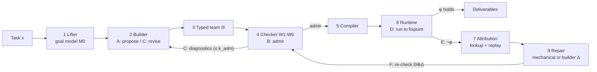

# AutoM2M

**Checking LLM-assembled agent teams with model transformations.**

Team builders let a large language model (LLM) design a team of LLM agents for each task. In such
teams every agent is specified only by a prose role, every hand-off is free text, and nothing checks
that the parts fit before the team runs: the **composition gap**. AutoM2M applies model-driven
engineering to team building, with one principle at two levels: *LLMs propose; programs decide.*

- A builder LLM proposes a **typed team**: per-agent view metamodels, hybrid model-to-model (M2M)
  hand-off transformations, write rights, tools, goal obligations and an engine-checked acceptance
  predicate φ.
- A deterministic **checker** admits the team only if six well-formedness conditions W1–W6 hold,
  including a two-sided, feature-level *anchoring* criterion for coverage.
- Admitted teams run on **AgentHOT** (Agent Hand-Off Transformations), AutoM2M's execution layer: a
  compiler and a runtime in which a deterministic engine fixes the structure of every hand-off and LLMs
  fill only its values, from declared footprints and behind validators.
- When φ fails, **trace models** turn attribution into a lookup plus a bounded replay, and every
  **repair** passes the same checker before it is applied.

This repository is the implementation and replication package of the paper
[`docs/emse-autom2m.tex`](docs/emse-autom2m.tex) (*When the Team Writes Itself: An Empirical Study of
Composition Defects in LLM-Assembled Agent Teams and Their Prevention with Model Transformations*).

> **Status.** Research prototype for Python coding tasks (ClassEval / HumanEval+ style: implement the
> methods of one class or one function). Every experiment of the paper is implemented; real runs
> exist for Qwen2.5-Coder 7B (see [Results](#results-qwen25-coder-7b)), the other six models of the
> design use the same scripts.

---

## The approach (paper Sec. 3)



| Component (Fig. 1) | What it does | Code |
|---|---|---|
| 1 Lifter | Deterministic injection of the task into the goal model M0 (`Task`, `Method`, `Example`; doctests moved out of docstrings). | [`autom2m/lift.py`](src/autom2m/lift.py), [`pywork.py`](src/autom2m/pywork.py) |
| 2 Builder | Proposer and Reviser; prompt library with the schema, the validator library and three worked examples (2, 3, 4 agents). | [`autom2m/prompts.py`](src/autom2m/prompts.py), [`examples.py`](src/autom2m/examples.py), [`loop.py`](src/autom2m/loop.py) |
| 3 Typed team Θ | (A, V, **T**, ω, κ, G, δ, φ) as JSON; obligations (C, s, μ, F_C). | [`autom2m/typed_team.py`](src/autom2m/typed_team.py) |
| 4 Checker | W1–W6 (Algorithm 3), validator library (Table 4), located diagnostics with hints. | [`autom2m/checker.py`](src/autom2m/checker.py), [`vlib.py`](src/autom2m/vlib.py) |
| 5 Compiler | Synthesis higher-order transformation: metamodels and rule modules; footprints stamped over fp ∪ vr. | [`agenthot/compiler.py`](src/agenthot/compiler.py), [`rt_helpers.py`](src/agenthot/rt_helpers.py) |
| 6 Runtime | Hybrid hand-offs (Algorithm 2), trace store, validator sandbox, φ = cover(G) ∧ valid ∧ fresh ∧ noEsc. | [`agenthot/engine/`](src/agenthot/engine/), [`team/runtime.py`](src/agenthot/team/runtime.py), [`session.py`](src/agenthot/session.py), [`sandbox.py`](src/agenthot/sandbox.py) |
| 7 Attribution | Lookup, then Algorithm 4: validator / sampling / footprint(j) / upstream / specification; adaptive replays. | [`autom2m/attribution.py`](src/autom2m/attribution.py) |
| 8 Repair | Cheapest repair first; every delta re-checked; applied in place, by extension, or by rebuild. | [`autom2m/repair.py`](src/autom2m/repair.py) |

### The six admission conditions

| Condition | Rules out |
|---|---|
| **W1** hand-offs are well typed and stratified (no guard or structural binding reads an LLM-written feature) | D2 hand-off mismatch (formal part) |
| **W2** every artefact has one writer; every class one producing rule | D3 ownership conflict |
| **W3** targets are complete; references resolve | D2 (content part) |
| **W4** every goal is anchored: anchor features reach one behaviour-checked value along production edges *and* along production edges followed by a check edge; delivered goals reach δ; no idle or unverified view | D1 coverage gap |
| **W5** the engine decides completion (four engine clauses, library clauses, no agent claim); acyclic hand-off graph | D4 unverifiable completion |
| **W6** work goes to agents that can do it: τ(b) ⊆ κ(owner(b)) | D5 capability mismatch |

On the paper's illustrative first proposal (Listing 5) the checker prints exactly Listing 6:

```bash
python -m autom2m.checker teams/devteam_proposal.json
```
```
W1  Design2Impl.body: footprint path 'd.returnType':
        Design!MethodDesign has no feature 'returnType'
W2  view Test written by ['Developer', 'Tester']; needs exactly one writer
W4  goal (Example, all, checked): anchor features {call, expected}
        reach no behaviour-checked value
W5  done-clause Tester.says('ALL TESTS PASS') is not an engine clause
W6  Impl2Run.verdict needs ['exec']; writer Tester has []
REJECTED: 5 violation(s)
```

---

## Quick start

Requires Python ≥ 3.11 and, for anything that calls an LLM, an [Ollama](https://ollama.com) server.

```bash
python -m venv .venv && source .venv/bin/activate
pip install -e ".[dev,eval]"
pytest tests plugin/tests                    # no LLM needed

python -m autom2m.checker teams/devteam_admitted_g2.json --w4 one-sided   # W4 variants: two-sided (default), one-sided, path-only
```

Solve one task end to end:

```python
from autom2m.loop import AutoM2M
from agenthot.llm.metered import MeteredBackend
from agenthot.llm.ollama_backend import OllamaBackend
from evaluation.benchmarks import tasks as T
from evaluation.harness.workbench import TaskWorkbench

task = T.load("classeval")[0]
llm = MeteredBackend(OllamaBackend("http://localhost:11434", "qwen2.5-coder:7b", seed=1, num_ctx=16384))
out = AutoM2M(llm).solve(task, task.prompt, TaskWorkbench(task))   # k_adm=3, k_rep=2, k=3, n_rep=3, h=2
print(out.status, out.admitted_round, out.clauses, [r["mode"] for r in out.repairs])
```

`out` records the status (`done`, `failed`, `not_admitted`), the deliverables, every admission round's
diagnostics, the fault reports and repairs, the number and time of checks, and wall-clock per step.

### Host mode: Claude (or you) as the builder

`autom2m auto` keeps a session in `.autom2m/` (task, admitted team, run state, history):

```bash
autom2m auto task calculator.py          # a class with stub methods (docstrings with >>> examples), or a stub function
autom2m auto propose --prompt-only       # the builder prompt; answer it with a typed-team JSON
autom2m auto submit team.json            # W1-W6: admitted, or rejected with diagnostics
autom2m auto run                         # fixpoint + phi; open values are pending
autom2m auto bindings                    # footprint-bounded prompts to answer
autom2m auto fill <target_key> <binding> answer.txt <footprint_version>
autom2m auto deliverable --code
autom2m auto --llm ollama solve calculator.py   # the whole loop unattended with an engine LLM
```

The same operations are MCP tools of the **autom2m Claude Code plugin** ([`plugin/autom2m/`](plugin/autom2m/)):
`auto_task_set`, `auto_check`, `auto_propose`, `auto_submit_team`, `auto_run`, `auto_next_bindings`,
`auto_submit_binding`, `auto_status`, `auto_attribute`, `auto_deliverable`, `auto_solve`, `auto_reset`,
plus the AgentHOT tools for hand-written teams (`team_init`, `run`, `impact`, `team_evolve`, …).

### The hosted service

```bash
pip install -e ".[serve]" && (cd web && npm ci && npm run build)
autom2m serve --port 8765          # web app, REST API (/api/docs) and MCP endpoint (/mcp)
```

Code execution on a shared service fails closed unless an isolating sandbox is configured
(`AGENTHOT_SANDBOX=bwrap` or `command` with `AGENTHOT_SANDBOX_CMD`); see [`.env.example`](.env.example).

---

## Reproducing the evaluation (paper Sec. 4)

```bash
git clone https://github.com/ag2ai/Agents_Failure_Attribution data/Agents_Failure_Attribution   # Who&When
evaluation/scripts/ollama_parallel.sh 11435 16 &          # a batching Ollama server (5x throughput)
nohup evaluation/scripts/run_qwen7b.sh > results/logs/run_qwen7b.log 2>&1 &
```

[`run_qwen7b.sh`](evaluation/scripts/run_qwen7b.sh) runs every study in a resumable order; `MODEL=…`
selects another subject model. The individual steps:

| RQ | Study | Command |
|---|---|---|
| RQ1 | Who&When specification audit | `python -m evaluation.rq1.audit_whowhen` |
| RQ1 | Decisive cause of 184 Who&When + 400 of our failures | `python -m evaluation.rq1.code_failures --source whowhen` / `--source ours --n 400` |
| RQ2 | Mutation analysis, 3 W4 variants × G1/G2 (Table 7) | `python -m evaluation.rq2.mutate` |
| RQ2 | Independently seeded defects, clean set, LLM critics (Fig. 5) | `python -m evaluation.rq2.independent seed` / `clean` / `critics` |
| RQ2 | Detach operator on builder-generated teams | `python -m evaluation.rq2.natural_mutants` |
| RQ2 | Cost of checking (Fig. 7a-b) | `python -m evaluation.rq2.scale` |
| RQ2-3 | Eight conditions × tasks × seeds (Tables 8-10, Figs. 6, 7c-d) | `python -m evaluation.run_matrix --bench classeval --model qwen2.5-coder:7b --seeds 1,2,3` |
| RQ3 | Composition-caused failures of all failing runs | `python -m evaluation.rq3.code_runs` |
| RQ4 | Fault injection, reference and builder teams | `python -m evaluation.rq4.inject --team ref` / `--team builder` |
| RQ4 | Transcript-based attribution (4 methods) on the same runs | `python -m evaluation.rq4.transcript --source ref` |
| RQ4 | Natural failures; repair vs rebuild | `python -m evaluation.rq4.natural`, `python -m evaluation.rq4.repair` |
| all | Every table, figure and number | `python -m evaluation.analysis.analyze && python -m evaluation.analysis.web_export` |

Outputs: raw logs in `results/raw/` and `results/runs/`, the analysis tables in `results/data/*.csv`,
LaTeX tables in `docs/tables/` and figures in `docs/figures/` (the names the paper uses), every number
in `results/summary.json`, and the website's data in `web/src/data/results.json`.

The eight conditions (Table 6): **Single**, **Single-Gate** (best-of-n up to AutoM2M's median token
budget, accepted when the public examples pass), **Free** (CaptainAgent-style), **Critic**, **Schema**
(PatchBoard-style), **Typed-NC** (AgentHOT without checker or repair), **AutoM2M**, **Typed-Ref** (the
hand-written DevTeam). Temperatures 0.2 for agents and bindings, 0.6 for builders; 4,096 output tokens
per call; k = 3 samples per binding. Coders, critics, the defect seeder and the attribution judge are
configurable (`AM2M_CODERS`, `AM2M_CRITICS`, `AM2M_SEEDER`, `AM2M_JUDGE`); by default they use the
subject model.

Teams see only the task prompt, signatures, docstrings and public examples; hidden tests are used only
for scoring. LLM-written code runs in a subprocess with resource limits; the network is not blocked, so
run the experiments in a container or VM.

---

## Results (Qwen2.5-Coder 7B)

See [`docs/results-qwen7b.md`](docs/results-qwen7b.md) for the numbers of the completed runs, how they
compare with the paper's (partly synthetic) placeholders, and what remains to run.

---

## Repository layout

| Path | Contents |
|---|---|
| [`src/agenthot/`](src/agenthot/) | **AgentHOT**, the hand-off level: rule language, structural engine, stochastic bindings, trace store, team runtime, compiler, φ evaluator, sandbox; workspaces and CLI for hand-written teams (`agenthot`). |
| [`src/autom2m/`](src/autom2m/) | **AutoM2M**, the team level: lifter, typed teams, validator library, checker, builder prompts and worked examples, the loop, attribution, repair; host-mode sessions, MCP server, hosted service, CLI (`autom2m`). |
| [`plugin/autom2m/`](plugin/autom2m/) | The autom2m Claude Code plugin (MCP server, skills, agents, hooks). |
| [`teams/`](teams/) | Hand-written typed teams: Listing 5 (`devteam_proposal`), the admitted DevTeam (G1/G2), the requirements team of the mutation study, the Typed-Ref team. |
| [`evaluation/`](evaluation/) | Benchmarks, conditions, the run matrix, RQ1–RQ4 studies, coding, analysis, schedules. |
| [`web/`](web/) | Project site and Services tab (React + Vite + React Flow). |
| [`examples/`](examples/) | Hand-written AgentHOT teams. |
| [`docs/`](docs/) | The paper, the paper-to-code map, results, generated tables and figures. |

## Documentation

- [`docs/emse-autom2m.tex`](docs/emse-autom2m.tex): the paper.
- [`docs/agenthot-autom2m.md`](docs/agenthot-autom2m.md): paper-to-code map (every definition,
  algorithm and condition), design decisions and known deviations.
- [`docs/results-qwen7b.md`](docs/results-qwen7b.md): results of the real runs.

## License

MIT, as declared in [`pyproject.toml`](pyproject.toml).
