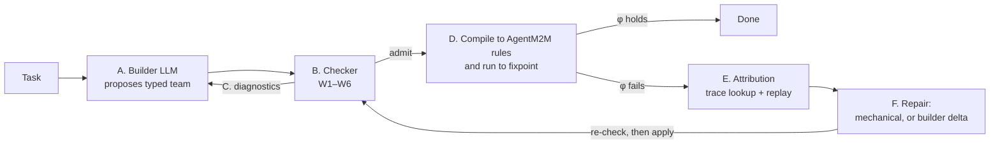

# From AgentM2M to AutoM2M: what changed in the code, what it does, and what it cannot do yet

This document explains, in plain language, how the AgentM2M code base was extended into AutoM2M:
which parts are new, which parts were changed, and which parts were reused as they were. It goes with
[`autom2m-explained-v1.tex`](autom2m-explained-v1.tex), which gives the research argument; this file
covers the code. The last two sections list everything AutoM2M cannot do today and give a plan for
supporting real-world projects.

> **Snapshot.** This describes the working tree on branch `dev` as of 2026-10-08. Almost everything is
> still untracked in git (the only commit holds the README). File and line references are to that tree.

---

## Contents

1. [The short version](#1-the-short-version)
2. [AgentM2M in one page (the starting point)](#2-agentm2m-in-one-page-the-starting-point)
3. [AutoM2M in one page (what it adds)](#3-autom2m-in-one-page-what-it-adds)
4. [Where the code came from](#4-where-the-code-came-from)
5. [The new `auto/` package, file by file](#5-the-new-auto-package-file-by-file)
6. [Changes to the AgentM2M engine](#6-changes-to-the-agentm2m-engine)
7. [The Claude Code plugin: unchanged, and why that matters](#7-the-claude-code-plugin-unchanged-and-why-that-matters)
8. [Evaluation code, team fixtures and results](#8-evaluation-code-team-fixtures-and-results)
9. [What the experiments show so far](#9-what-the-experiments-show-so-far)
10. [Limitations of AutoM2M](#10-limitations-of-autom2m)
11. [Plan for supporting real-world projects](#11-plan-for-supporting-real-world-projects)
12. [Appendix: mapping between the `.tex` document and the code](#appendix-a-mapping-between-the-tex-document-and-the-code)

---

## 1. The short version

- **AgentM2M** runs a team of LLM agents whose hand-offs are model-to-model (M2M) transformations.
  A **person** writes the team: the forms each agent fills in (metamodels), the rules that connect the
  forms, and the validators. A deterministic engine then builds the structure, and LLMs only fill in
  individual values.
- **AutoM2M** lets an **LLM write the team** (a "team builder"), and adds a deterministic **checker**
  that decides whether the proposed team may run. If the run fails, AutoM2M finds the responsible
  value through trace records, classifies the fault, and applies a repair after the same checker has
  approved it.
- In code, AutoM2M is almost entirely **additive**: one new package
  ([`src/agentm2m/auto/`](../src/agentm2m/auto/)), one new LLM wrapper
  ([`llm/metered.py`](../src/agentm2m/llm/metered.py)), a richer Ollama backend, and a one-line
  opt-in in the trace keys. The AgentM2M runtime (matching, rules, footprints, stamps, escalation) is
  reused **unchanged**. AutoM2M compiles a typed team down to ordinary AgentM2M rule files and runs
  them.
- The **Claude Code plugin was not updated**. It still exposes only AgentM2M; none of the AutoM2M
  features can be reached from Claude Code.
- AutoM2M currently works only for **Python coding tasks** (ClassEval and HumanEval+ style: implement
  the methods of one class or one function). Its task model, validators and benchmark adapter are all
  built around that.

---

## 2. AgentM2M in one page (the starting point)

AgentM2M treats a team of agents like a chain of form-filling clerks.

| Idea | Plain meaning | Where in code |
|---|---|---|
| **View metamodel** | The form an agent fills in: kinds of objects, their fields, their links. | [`metamodel/builder.py`](../src/agentm2m/metamodel/builder.py) (pyecore EMF classes) |
| **Hand-off rule** | "For every object of kind X in the source form (that passes the guard), create one object of kind Y in the target form and fill its fields." ATL-style syntax. | [`rules/grammar.lark`](../src/agentm2m/rules/grammar.lark), [`rules/parser.py`](../src/agentm2m/rules/parser.py) |
| **Structural binding** | A field the engine fills by a formula (`name <- s.title`). No LLM. | [`engine/binding.py`](../src/agentm2m/engine/binding.py) |
| **Stochastic binding** `@llm` | A field an LLM fills. The LLM sees only the declared **footprint** (the exact source data it may read). | same file, `apply_stochastic_binding` |
| **Validator** `@check` | A value is accepted only if its check passes; after *k* rejections the binding **escalates** instead of looping. | same file; [`engine/validators.py`](../src/agentm2m/engine/validators.py) |
| **Trace link + stamp** | "This object came from that one by this rule", plus a hash of the footprint at acceptance time. | [`engine/trace.py`](../src/agentm2m/engine/trace.py) |
| **Obligation** | After a source edit, exactly the values whose footprint hash changed are redone. | [`engine/obligations.py`](../src/agentm2m/engine/obligations.py) |
| **Team runtime** | Runs every hand-off repeatedly until nothing changes (fixpoint). | [`team/runtime.py`](../src/agentm2m/team/runtime.py) |
| **HOT** | Adding an agent at runtime is itself a transformation; the newcomer gets work for everything that already exists. | [`team/hot.py`](../src/agentm2m/team/hot.py) |
| **Workspace, MCP server, plugin** | Persist a team in `.agentm2m/`, expose it to Claude Code, let Claude fill the `@llm` values ("host mode"). | [`workspace.py`](../src/agentm2m/workspace.py), [`mcp_server.py`](../src/agentm2m/mcp_server.py), [`plugin/`](../plugin/) |

The important assumption: **a person wrote the metamodels, the rules and the validators.** Nothing
checks whether that person wrote a good team. The AgentM2M paper lists "learning the glue" (having
an architect agent propose the team) as its first open challenge. AutoM2M takes up that challenge.

---

## 3. AutoM2M in one page (what it adds)

AutoM2M applies AgentM2M's split one level higher:

- AgentM2M: *an LLM writes values; the engine owns structure.*
- AutoM2M: *an LLM proposes the team; a checker owns the decision to admit it.*



| Step | What happens | LLM or deterministic? | Code |
|---|---|---|---|
| A | The builder LLM writes a **typed team** in a fixed JSON format. | LLM | [`auto/prompts.py`](../src/agentm2m/auto/prompts.py), [`auto/loop.py`](../src/agentm2m/auto/loop.py) |
| B | The checker tests six conditions W1–W6 on the JSON alone: no task data, no LLM, no execution. | Deterministic | [`auto/checker.py`](../src/agentm2m/auto/checker.py) |
| C | Violations go back to the builder as exact diagnostics, for up to `k_adm` rounds. | LLM revises | `AutoM2M.solve` |
| D | The admitted team is turned into AgentM2M `.agentm2m` rule files and pyecore metamodels, then run by the unchanged runtime. The engine evaluates "done" (φ). | Deterministic structure, LLM values | [`auto/compile.py`](../src/agentm2m/auto/compile.py) |
| E | Each failed φ clause is traced to one value of one rule of one agent, then classified by cheap replays. | Lookup plus a bounded number of LLM replays | [`auto/attribution.py`](../src/agentm2m/auto/attribution.py) |
| F | Mechanical fixes where possible (retry, widen footprint, redo upstream value). Otherwise the builder proposes a revised team, which must pass the checker before it is applied to the running team. | Mixed | [`auto/repair.py`](../src/agentm2m/auto/repair.py), `AutoM2M._repair` |

The six conditions in plain words. Each one rules out one composition defect (D1–D5) from the `.tex`
document.

| Condition | Plain meaning | Rules out |
|---|---|---|
| **W1** well typed | Every rule reads only its source forms and writes only fields that exist; every footprint path exists; every LLM value has a known validator with correctly typed arguments. | D2 "lost in hand-off" (formal part) |
| **W2** one writer | Each form has exactly one owning agent; each kind of object is created by exactly one rule. | D3 "too many cooks" |
| **W3** complete | Every mandatory field is filled; every reference points to something some rule creates. | D2 (content part) |
| **W4** anchored coverage | Every goal must flow, through footprints or validator inputs, into a value checked by a *behavioural* validator (one that runs something). Every form must lie on such a flow. | D1 "nobody owns it" |
| **W5** engine decides "done" | φ is exactly `cover(G) ∧ valid ∧ fresh ∧ noObl`; no "the Tester says so" clauses; no cycles between forms. | D4 "done because someone said so" |
| **W6** right tools | An agent that owns an LLM value has every tool its validators need (today only `exec`). | D5 "wrong person for the job" |

---

## 4. Where the code came from

The repository is a fork of **AgentM2M 0.2.0** (the version with the Claude Code plugin). A sibling
checkout, `../DS-A2A`, carries AgentM2M forward to 0.3.0 (shared context, Nostr, observability).
M2MColab does **not** include those 0.3.0 features. Comparing the two trees shows what AutoM2M added on
top of the common 0.2.0 base:

| Area | Status in M2MColab | Notes |
|---|---|---|
| `src/agentm2m/auto/` (11 files, ~2,500 lines) | **New** | The whole of AutoM2M. |
| `src/agentm2m/llm/metered.py` | **New** | Per-call accounting by role (builder / binding / attribution / critic), token budget, optional transcripts. |
| `src/agentm2m/llm/ollama_backend.py` | **Changed** | `generate()` gained `format` (JSON / schema), `system` and `max_tokens`; new `chat()`; `num_ctx`. The builder depends on these. |
| `src/agentm2m/engine/trace.py` | **Changed (one block)** | Classes compiled from a typed team can opt in to being keyed by the engine's unique target key (`_amt_engine_keyed`). |
| `engine/`, `rules/`, `team/`, `metamodel/` (everything else) | **Unchanged from 0.2.0** | The runtime AutoM2M compiles onto. |
| `workspace.py`, `mcp_server.py`, `cli.py`, `store.py`, `templates/` | **Unchanged from 0.2.0** | AgentM2M-only. |
| `plugin/` | **Unchanged from 0.2.0** | AgentM2M-only (see [Section 7](#7-the-claude-code-plugin-unchanged-and-why-that-matters)). |
| `evaluation/` | **Rewritten** | The 0.2.0 DevBench / SWE-bench evaluation was replaced by an AutoM2M study: baselines, benchmarks, RQ1–RQ3 scripts, analysis. |
| `teams/` | **New** | Hand-written typed teams used by the tests, the mutation study and the reference condition. |
| `tests/test_auto_checker_runtime.py` | **New** | Checker, compile, run, attribution and repair tests. |
| `data/Agents_Failure_Attribution/` | **New (external)** | Who&When dataset clone, input to the RQ1 audit. |
| `results/`, `docs/tables/`, `docs/figures/` | **New** | Raw run logs and generated tables and figures. |

The test suite currently passes: `pytest tests plugin/tests` reports 91 passed, 3 skipped.

The design rule behind this layout: **AutoM2M must not need a special runtime.** A typed team is
compiled into the same artifacts a person would write for AgentM2M, so every guarantee of the
AgentM2M engine (bounded footprints, stamps, escalation instead of infinite loops, exact obligations)
carries over unchanged.

---

## 5. The new `auto/` package, file by file

### 5.1 `typed_team.py`: the format the builder must write

[`auto/typed_team.py`](../src/agentm2m/auto/typed_team.py) defines the **typed team**
Θ = (A, V, T, ω, κ, τ, G, φ) as a JSON format and a parser for it.

In plain words, instead of a pile of job descriptions the builder must hand over a blueprint:

| JSON key | Meaning | Symbol |
|---|---|---|
| `agents` | Name, prose role ("how it thinks"), and `tools` (today only `"exec"`). | A, κ |
| `views` | One form per agent: classes with attributes (`"string"`, optional `"string?"`) and references (`"View.Class"`, `required`, `many`). | V |
| `writes` | Which agent owns which form. | ω |
| `handoffs` | Source forms, a target form, and rules. A rule has `from` (typed variables), an optional `guard`, `to`, `bind` (navigation paths or literals) and `llm` (feature, prompt, footprint paths, validators). | T |
| `goal` | Goal obligations: a goal class, a scope, and a kind: `checked` (must reach a behavioural check) or `delivered` (must produce the deliverable). | G |
| `deliverable` | Which field of which class is the final product, and which goal object it belongs to. | – |
| `done` | Must be exactly `["cover(G)", "valid", "fresh", "noObl"]`. | φ |
| (validator tool needs) | Taken from the validator library, not written by the builder. | τ |

The format is **deliberately narrow** so that every condition can be decided mechanically:
structural bindings and footprints are only navigation paths (`m.task.skeleton`) or quoted literals;
validators come only from a library; φ is a list of clause names.

The file also contains `type_path()`. It walks a path such as `d.method.docstring` through the
declared classes, reports the exact error if a step does not exist, and records every
(class, feature) the path **reads**. The checker uses those reads to build its data-flow graph, and the
attribution step uses them to find upstream values.

### 5.2 `vlib.py`: the validator library

[`auto/vlib.py`](../src/agentm2m/auto/vlib.py) is the **only** set of validators a builder may use. In
AgentM2M, validators were arbitrary Python in a `helpers.py` written by a person. AutoM2M cannot let an
LLM write arbitrary checking code, so it offers a fixed catalogue in which each entry declares:

- **strength**: `form` (parses / compiles / is JSON) or `behaviour` (executes the value against
  something);
- **tools**: what the owning agent must have (feeds W6);
- **parameters**: each either a `read` (its data flows into the check, so it adds edges to the W4
  data-flow graph) or a `locator` (it only says which goal object the value belongs to).

| Validator | Strength | Needs | Checks |
|---|---|---|---|
| `nonempty`, `json`, `compiles`, `defines` | form | – | non-empty text / JSON / Python parses / defines the method |
| `runs` | behaviour | exec | code runs without raising |
| `examples_run` | behaviour | exec | method, spliced into the class, runs its docstring examples without unexpected exceptions |
| `examples_match` | behaviour | exec | as above, and printed results equal the documented ones |
| `passes_tests` | behaviour | exec | method passes given test code |
| `test_valid` | behaviour | exec | test code calls the method **and fails on a stub** (so it actually tests something) |
| `unsat`, `flaky`, `weak` | – | – | fault injection only (RQ3); never offered to a builder |

Validators do not run code themselves. They call a **Workbench** (a small protocol: `assemble`,
`run_examples`, `run_tests`, `extract_function`, …) that a benchmark adapter provides, through a
per-run `RunContext`. The only Workbench implementation is
[`evaluation/harness/workbench.py`](../evaluation/harness/workbench.py).

### 5.3 `checker.py`: the admission decision (Steps B–C)

[`auto/checker.py`](../src/agentm2m/auto/checker.py) implements W1–W6 (`w1()` at line 97 to `w6()` at
line 412). Run it on its own with:

```bash
python -m agentm2m.auto.checker teams/devteam_proposal.json          # anchored W4 (default)
python -m agentm2m.auto.checker teams/devteam_proposal.json --naive  # class-level W4, for comparison
```

How each condition is computed, in plain words:

- **W1** types every hand-off source and target, every `bind` path, every footprint path, every guard
  path and every validator argument against the declared classes. It also checks that no path reads a
  form that is not a source of its hand-off.
- **W2** counts writers per form and producing rules per class.
- **W3** checks that each mandatory field is bound exactly once, and that a reference binding which
  yields a source object can be resolved (some rule maps that source class to the expected target
  class, as ATL's implicit resolution needs).
- **W4** builds a **feature-level data-flow graph** (`dataflow()`, line 255). There is an edge from
  `(C, f)` to `(D, g)` whenever a binding that writes `D.g` reads `C.f`, through its expression, its
  footprint, or a `read` argument of its validator. It then asks whether data from each goal class
  reaches a behaviour-checked feature. That is **anchored coverage**. A `--naive` mode only asks
  whether a class-level path exists; the mutation study uses it to show why anchoring matters. W4 also
  requires every form to be reachable from the goal and to lead to a behavioural check, so there are
  no idle or unverified agents. Guards that differ from an obligation's scope produce only a
  *warning*; instance-level coverage is left to the runtime clause `cover(G)`.
- **W5** compares `done` with the fixed vocabulary and runs a cycle test (Kahn's algorithm) on the
  hand-off graph.
- **W6** compares each owner's tools with the union of the tool needs of the validators on its LLM
  values.

Every diagnostic names the condition, the offending element and how to fix it, for example
`W6  Edit2TestRun.verdict needs ['exec']; owner Tester has []`. These strings go to the builder
verbatim in Step C.

### 5.4 `compile.py`: from typed team to a running AgentM2M team (Step D)

[`auto/compile.py`](../src/agentm2m/auto/compile.py) is the bridge to the old engine. Nothing in it is
new runtime logic; it **generates** the artifacts a person would have written:

| Typed-team element | Becomes | Function |
|---|---|---|
| `views` | pyecore metamodels via `MetamodelBuilder`, one root class per view | `build_metamodels` |
| the task | the **Goal** model, filled by a deterministic Lift | `lift_task` |
| each hand-off | a generated `.agentm2m` rule module in a temp directory, parsed by the normal parser | `generate_module`, `compile_team` |
| each `llm` entry | `feature <- @llm(prompt_of(key), fp(...))` plus `@check v_<id>(...) and ...` | `generate_module` |
| validators | helper functions loaded via `uses 'helpers.py'`, which re-exports [`rt_helpers.py`](../src/agentm2m/auto/rt_helpers.py) | – |
| φ | `cover(G) ∧ valid ∧ fresh ∧ noObl`, evaluated after the run | `Session.evaluate` |

Some details matter for understanding the limitations later on:

- **The Goal view is fixed**: `Task(name, description, skeleton)` and
  `Method(name, signature, docstring, examples?, task)`. `repair.normalize()` overwrites whatever goal
  view the builder wrote with this one. This is what ties AutoM2M to coding tasks.
- **Prompts are kept out of the rule text.** The generated rule only contains a key; the real prompt
  (role, task, output-format hint derived from the validators) lives in a per-run registry. This keeps
  the generated grammar simple.
- **Hand-offs are registered in topological order**, so a single runtime pass already respects data
  dependencies.
- The `Session` class wraps an AgentM2M `TeamRuntime` and keeps it alive across repairs. Its
  `evaluate()` computes φ:
  - `noObl`: no escalation is open;
  - `fresh`: every stamp matches its current footprint (the runtime's `stamps_fresh()`);
  - `valid`: every accepted *behavioural* value is re-validated on the **final** models (a method
    accepted early may break once later methods are spliced in);
  - `cover(G)`: every goal object in scope has, through trace links, a descendant with an accepted
    behaviour-checked value, and a deliverable if the obligation is `delivered`.
- Failed φ clauses become `Failure` records that name the hand-off, rule, target and binding. These
  are the input to attribution.

### 5.5 `rt_helpers.py`: the glue loaded by generated rules

[`auto/rt_helpers.py`](../src/agentm2m/auto/rt_helpers.py) provides the OCL-callable helpers used by
generated modules: `nav` (multi-step navigation that flattens many-valued references), `fp` (renders
the footprint as labelled text), `prompt_of`, and every validator wrapped as `v_<id>`. The wrapper
records the **last rejected value** per goal element. A run that escalates can then still submit a
best-effort deliverable, and attribution can re-check the exact value that failed.

### 5.6 `loop.py`: Algorithm 1 end to end

[`auto/loop.py`](../src/agentm2m/auto/loop.py), class `AutoM2M`, `solve()` at line 113:

1. **Propose**: ask the builder (with `format="json"`) for a typed team, or start from an
   `initial_team` (used by the hand-written reference condition).
2. **Admit**: parse, check, and compile. A compile error is reported as a W1 diagnostic.
3. **Revise** up to `k_adm` rounds (default 3), sending the diagnostics back.
4. **Run** the session to a fixpoint.
5. Up to `k_rep` repair rounds (default 2): **attribute** the failures, **repair**, run again.
6. Return an `AutoOutcome`: status (`done`, `failed`, `not_admitted`, `compile_error`), the
   deliverables, the first and final team, all diagnostics, fault reports, repairs and timing.

Switches `check_enabled` and `repair_enabled` produce the ablation conditions `typed_unchecked`
(the typed format without the checker) and `typed_ref` (a hand-written team with repair).

### 5.7 `attribution.py`: who broke it? (Step E)

[`auto/attribution.py`](../src/agentm2m/auto/attribution.py) turns each failure into a
`FaultReport`.

- **Locate**: a `valid` or `noObl` failure already names (hand-off, rule, target, binding); the
  owning agent is a lookup. A `cover(G)` failure names the goal object and the first rule on its path.
- **Classify**, in this order, with at most 2·r LLM calls per binding:
  0. **validator fault**: run the failing validator twice on the same value; different verdicts
     mean the check is unreliable, so no agent is blamed;
  1. **sampling fault**: replay the binding on the same footprint; if a sample now passes, the LLM
     was just unlucky;
  2. **footprint fault**: replay with a footprint widened by one hop (all attributes of the source
     variables and of their direct references); if that passes, the hand-off did not carry enough;
  3. **upstream fault**: if a footprint value was itself written by an LLM upstream, re-sample that
     value, temporarily put it in place, and replay; if that passes, blame the upstream binding;
  4. **specification fault**: otherwise, the prompt or validator cannot be satisfied from this
     footprint.
- `attribute_all()` attributes at most `limit=2` distinct root failures per round, and skips
  failures that are only consequences of an already located one.

### 5.8 `repair.py`: checked re-composition (Step F)

[`auto/repair.py`](../src/agentm2m/auto/repair.py) plus `AutoM2M._repair` in `loop.py` choose a remedy
per fault class:

| Fault class | Remedy | Who changes what |
|---|---|---|
| sampling | `retry_bindings`: clear the "failed" mark, giving the binding a fresh budget | mechanical |
| upstream | `resample_upstream`: delete the upstream stamp, which makes the value an obligation | mechanical |
| footprint | add the widening paths that worked to the binding's footprint in the team JSON | mechanical team delta |
| specification, coverage, validator | ask the builder for a revised team (`delta_prompt`) | LLM team delta |

**Every team delta is re-checked** with W1–W6 before it is applied. `apply_delta()` then picks the
cheapest safe way to apply it:

- **in-place**: only rules, prompts, footprints or validators changed. Affected modules are
  regenerated; bindings whose prompt or validator changed lose their stamp (they become obligations);
  a changed footprint is caught automatically by the stamp check; every other accepted value is kept.
- **hot**: only new forms, agents or hand-offs were added. They are added to the running team
  (AgentM2M HOT semantics), so the newcomers get work for existing objects.
- **rebuild**: anything else (a changed or removed form, changed write rights, a retargeted hand-off).
  The team is compiled from scratch and every accepted value is lost, just as with a free-form
  builder.

### 5.9 `prompts.py` and `examples.py`: what the builder sees

[`auto/prompts.py`](../src/agentm2m/auto/prompts.py) assembles three prompts: propose, revise
(with diagnostics) and delta (with fault reports). Each one restates the JSON format, the fixed Goal
view, the validator catalogue and a plain-language version of W1–W6.
[`auto/examples.py`](../src/agentm2m/auto/examples.py) holds **one** worked example (a `ParkingMeter`
class, not part of any benchmark) rendered three ways: as a typed team for the typed conditions, as
prose for the free and critic baselines, and as roles for the schema baseline. All conditions
therefore get the same example in their own format.

---

## 6. Changes to the AgentM2M engine

AutoM2M needed only three small engine changes. All are backward compatible, and every AgentM2M test
still passes.

1. **Engine-keyed trace identities** ([`engine/trace.py:30`](../src/agentm2m/engine/trace.py#L30)).
   AgentM2M identifies objects by a business key (`Type#id` or `Type#name`). A builder cannot be
   trusted to make names unique (two `MethodDesign` objects may both be called `__init__`), so classes
   compiled from a typed team set `_amt_engine_keyed`, and are then keyed by the engine's unique
   target key instead. Hand-written AgentM2M teams are unaffected.
2. **Richer Ollama backend** ([`llm/ollama_backend.py`](../src/agentm2m/llm/ollama_backend.py)).
   `generate()` accepts `format="json"` (or a JSON schema) for structured output, plus `system` and
   `max_tokens`. A new `chat()` serves the multi-turn baselines, and `num_ctx` gives large team prompts
   room. The builder's JSON call relies on these keyword arguments.
3. **Metered backend** ([`llm/metered.py`](../src/agentm2m/llm/metered.py)). This wrapper records every
   call with the **role** that made it (`builder`, `binding`, `attribution`, `critic`, …), its tokens
   and its latency. It can enforce a per-run output-token budget and keep transcripts for RQ3. The
   loop switches `llm.role` around each step, which is how cost is reported per pipeline step.

What was **not** changed, deliberately: matching, rule execution, structural and stochastic binding
semantics, stamps, escalation, obligations, the fixpoint loop, HOTs. AutoM2M only generates input for
them.

---

## 7. The Claude Code plugin: unchanged, and why that matters

The [`plugin/`](../plugin/) directory is the AgentM2M 0.2.0 plugin as it was (see
[`plugin/DEVELOPMENT_PLAN.md`](../plugin/DEVELOPMENT_PLAN.md) and its
[CHANGELOG](../plugin/agentm2m/CHANGELOG.md)):

- **12 MCP tools**: `team_init`, `team_status`, `team_validate`, `model_show`, `model_edit`,
  `impact`, `run`, `next_bindings`, `submit_binding`, `trace_query`, `team_evolve`, `acceptance`.
- **Skills**: `/agentm2m:init`, `run`, `change`, `evolve`, `status`, `author-handoff`, plus background
  concepts.
- **Agents**: `binding-worker` (fills `@llm` values from their prompt only, and has no file access, so
  footprint discipline holds inside Claude Code) and `handoff-architect` (a *person-guided* designer of
  metamodels and rules).
- **Hooks**: a status line at session start, and re-validation after edits to the team spec, rules
  or helpers.

None of these mentions typed teams, the checker, attribution or repair. In particular:

- there is no MCP tool to **check** a typed team, **propose** one, **run** the AutoM2M loop or
  **attribute** a failure;
- `handoff-architect` is the manual counterpart of the AutoM2M builder, but its output is never
  checked by W1–W6. It only runs `team_validate`, which is a syntax check;
- the plugin's workspace format (`team.yaml` plus hand-written rules) and the typed-team JSON format
  are two different representations, with no converter in either direction;
- **host mode** (Claude fills values) does not work with AutoM2M: `Session.run()` would receive
  pending bindings and has no loop to hand them to Claude.

So today AutoM2M is a **library and research harness only**. [Section 11](#11-plan-for-supporting-real-world-projects)
lists what it would take to bring it into the plugin.

---

## 8. Evaluation code, team fixtures and results

### 8.1 Team fixtures (`teams/`)

| File | Role |
|---|---|
| [`devteam_proposal.json`](../teams/devteam_proposal.json) | The seeded proposal of the `.tex` Listing 5: one instance of each defect D1–D5. The checker must report exactly W1, W2, W4, W5, W6. |
| [`devteam_admitted.json`](../teams/devteam_admitted.json), [`_g2`](../teams/devteam_admitted_g2.json) | A corrected DevTeam; G1 declares only criteria as goals, G2 also declares deliverables. |
| [`chakin_pilot.json`](../teams/chakin_pilot.json) | An encoding of the hand-written AgentM2M pilot team on DevBench `chakin`. The checker rejects it (two W4 violations: code is never behaviourally verified). |
| [`chakin_repaired.json`](../teams/chakin_repaired.json), [`_g2`](../teams/chakin_repaired_g2.json) | The same team after one delta. |
| [`classeval_reference.json`](../teams/classeval_reference.json) | The hand-written reference team for ClassEval (Tester → tests, Developer → code); `typed_ref` condition and RQ3 fault injection. |
| [`make_fixtures.py`](../teams/make_fixtures.py) | Generates the fixtures. |

### 8.2 The experiment harness (`evaluation/`)

| Module | Purpose |
|---|---|
| [`benchmarks/tasks.py`](../evaluation/benchmarks/tasks.py) | Loads ClassEval and HumanEval+ into one shape. Teams see only the prompt, signatures, docstrings and public doctest examples; **hidden tests are used only for scoring**. |
| [`benchmarks/sandbox.py`](../evaluation/benchmarks/sandbox.py) | Runs LLM-written Python in a subprocess with CPU, memory, file and process limits and a timeout. **Network is not blocked.** |
| [`harness/workbench.py`](../evaluation/harness/workbench.py) | The Workbench that AutoM2M validators execute against. |
| [`conditions/baselines.py`](../evaluation/conditions/baselines.py) | Re-implemented baselines with the same model, tools, example and turn budget: `single` (one agent plus 2 fix rounds), `free` (CaptainAgent-style prose roles, group chat, TERMINATE), `critic` (free plus an LLM critic for D1–D5), `schema` (PatchBoard-style JSON patches to one shared board). |
| [`run_matrix.py`](../evaluation/run_matrix.py) | Conditions × tasks × seeds for one Ollama model; resumable. Conditions: `single, free, critic, schema, typed_unchecked, autom2m, typed_ref`. |
| [`rq1/audit_whowhen.py`](../evaluation/rq1/audit_whowhen.py) | The lexical audit of the 126 Who&When team specifications. |
| [`rq1/code_failures.py`](../evaluation/rq1/code_failures.py) | Two LLM coders label the decisive cause of failures (codebook D1–D5 / reasoning / tool / other), measure κ, then adjudicate. |
| [`rq2/mutate.py`](../evaluation/rq2/mutate.py) | Nine mutation operators over admitted teams, checked with anchored and naive W4. |
| [`rq2/natural_mutants.py`](../evaluation/rq2/natural_mutants.py) | The same operators on **builder-generated** admitted teams. |
| [`rq2/independent.py`](../evaluation/rq2/independent.py) | Mutants seeded by an LLM that sees only the defect descriptions, never W1–W6, plus an LLM critic's detection rate on prose renderings. |
| [`rq2/scale.py`](../evaluation/rq2/scale.py) | Checker cost on synthetic chain teams. |
| [`rq3/inject.py`](../evaluation/rq3/inject.py) | Injects upstream, footprint, specification, sampling and validator faults into runs of the reference team, with known ground truth. |
| [`rq3/baselines_transcript.py`](../evaluation/rq3/baselines_transcript.py) | Who&When-style transcript attribution (all-at-once, step-by-step, binary search) on the same runs. |
| [`analysis/analyze.py`](../evaluation/analysis/analyze.py), [`stats.py`](../evaluation/analysis/stats.py) | Produce `docs/tables/*.tex`, `docs/figures/*.pdf` and `results/summary.json` (bootstrap CIs, Wilcoxon / McNemar with Holm correction, Cliff's δ). |

---

## 9. What the experiments show so far

All numbers come from [`results/summary.json`](../results/summary.json) and
[`results/runs/`](../results/runs/), as they are on disk now. **They are preliminary.** Only ClassEval
with `qwen2.5-coder:7b` (100 tasks, 1 seed) is complete. The 27B model has 3–4 tasks per condition,
HumanEval+ has only a pilot, and the RQ1 and RQ3 sections of the summary are still empty.

**Static checker (RQ2, hand-written teams).** Against the current mutation results, anchored W4 catches
88 of 88 mutants under G2 (87 of 88 under G1: deleting `Story2Operation` escapes until deliverables
are declared). Naive W4 misses both "detached goal" mutants. There are no false alarms on unmutated
teams. Cost: 0.09 s for 1,000 views and 0.74 s for 3,000 views.

**End-to-end (ClassEval, 7B, 100 tasks).** Share of tasks whose hidden tests all pass:

| single | free | critic | schema | typed_unchecked | **autom2m** | typed_ref |
|---|---|---|---|---|---|---|
| 0.33 | 0.26 | 0.28 | 0.23 | 0.22 | **0.25** | 0.29 |

- No difference between AutoM2M and any other condition is statistically significant (Holm-corrected
  p ≥ 0.61). AutoM2M is not better than a single agent here.
- AutoM2M costs the most: about 10,100 output tokens and 349 s per task, against 1,900 tokens and
  68 s for `single` (≈5× tokens) and 3,100 tokens for `free` (≈3×).
- **"Done" is more trustworthy.** φ held in 29 runs, and 52% of those passed the hidden tests,
  compared with 14% of runs in which φ failed. In `free`, 71 runs declared TERMINATE, and only 31% of
  those passed. On the other hand, 14 of the 29 φ-true runs still failed hidden tests (validators too
  weak), and 10 runs passed hidden tests although φ failed (φ too strict).
- **The checker never had anything to reject.** All 100 builder proposals were admitted on the first
  try (0 revision rounds), and 100 of 103 final teams have the same three agents, the same four views
  and the same validators as the worked example. The builder copies the example; the admission loop
  (Steps B–C) has not been exercised by a real builder yet. This also explains why
  `typed_unchecked` behaves almost like `autom2m`.
- **Repair rarely changes the team.** In 105 repair rounds, the builder returned an unchanged team
  70 times. 13 rounds applied an in-place delta, the rest were mechanical retries. Fault classes
  across all runs: specification 121, upstream 31, footprint 9, sampling 4.
- **A blind spot on natural teams.** The "detach goal" mutation removes goal data from every
  footprint. It was caught 0 times out of 88 on builder-generated teams, because those teams use
  `examples_run(method=m)`, whose `method` argument *reads* the goal object. W4 therefore counts the
  goal as anchored even when the LLM that writes the code never sees it (see
  [Section 10.3](#103-the-checker-w1w6)).

**Mismatches between the `.tex` document and the current result files.** These numbers should be
regenerated before they are cited:

| Quantity | `.tex` | current files |
|---|---|---|
| Failed Who&When runs ended by an agent's TERMINATE | 99 / 126 | 82 / 126 |
| Roles with a hand-off-like phrase | 27 / 356 | 32 / 356 |
| Runtime messages naming a teammate (CaptainAgent) | 61 / 796 | 60 / 670 |
| Same, Magentic-One | 1,486 / 2,935 | 2,187 / 2,925 |
| Mutants (total; break footprint; drop mandatory) | 82; 8; 20 | 88; 11; 23 |
| Naive W4 detections under G2 | 80 | 85 |
| Checker time for 3,000 views | 1.8 s | 0.74 s |
| Reference checker | `teamcheck.py`, ~300 lines, no dependencies | `agentm2m/auto/checker.py` (454 lines) plus `typed_team.py` and `vlib.py` |

---

## 10. Limitations of AutoM2M

This section is meant to be complete. It starts with the limits the design accepts on purpose (also
stated in the `.tex` document), then goes through the ones visible in the code, and ends with the
gaps in the evidence.

### 10.1 Limits of the idea itself

1. **The checker cannot tell whether the forms fit the task.** W1–W6 check that the team fits
   *together*, not that its metamodels contain what the task needs. A missing concept becomes a
   detectable defect only if the goal view declares it as an obligation.
2. **Validator strength is not checked.** W4 requires *a* behavioural validator on every goal path,
   not a *good* one. Weak validators turn wrong values into accepted ones. Evidence: 14 of the 29 runs
   with φ true still failed the hidden tests.
3. **Agent reasoning errors are out of scope.** A well-composed team of weak agents still fails.
   AutoM2M can at best label those failures as sampling or specification faults.
4. **Some teams do not fit forms and rules.** Debate, brainstorming, open-ended exploration and
   negotiation get their value from free dialogue. Typing them may cost more than it helps.
5. **Coverage is only relative to the declared goals.** Obligations that are not declared are not
   checked. The mutation study shows a deliverable escaping until it is declared (G1 vs G2).

### 10.2 Scope and generality: built for Python methods only

6. **Fixed Goal view.** The task is always lifted into `Task` + `Method(signature, docstring,
   examples)` ([`compile.py`](../src/agentm2m/auto/compile.py), `GOAL_VIEW` and `lift_task`), and
   `normalize()` overwrites any other goal view. Requirements documents, issues, incidents, datasets,
   multi-file repositories or UI specifications cannot be expressed.
7. **Fixed deliverable shape.** One code string per goal `Method`, extracted with
   `extract_function`. Multi-file patches, configuration, documents or data artifacts are not
   supported.
8. **Code-only validator library.** All behavioural validators execute Python methods against
   docstring examples or unit tests. There are no validators for schemas, API contracts, linters,
   type checkers, integration tests, documents, numeric answers or human approval.
9. **Single tool.** The only tool in κ is `exec`. Repository read access, search, web, database,
   browser or deployment tools cannot be declared, so W6 has nothing to say about them.
10. **Hard-coded names.** Attribution looks for a goal object whose class is literally `Method`
    (`attribution.py`), and the output-format hints in `compile.py` assume methods. Changing the domain
    means touching these spots.
11. **The Workbench lives in `evaluation/`.** `agentm2m.auto` cannot solve anything without a
    benchmark adapter, and the only adapter is the experiment harness. `bench.bind(...)` is called by
    the loop but is not part of the `Workbench` protocol.

### 10.3 The checker (W1–W6)

12. **Validator-only anchoring (observed blind spot).** W4 counts a validator's `read` argument as
    data flow. A team whose code-writing LLM never sees the goal, but whose validator reads it (e.g.
    `examples_run(method=m)`), passes W4. On builder-generated teams the "detach goal" mutant was
    caught 0 of 88 times. Whether that is acceptable (the value *is* checked against the goal) or a
    D1 defect (the producer works blind) is a design decision that has not been made yet.
13. **W2 is conservative.** Exactly one writer per form and one producing rule per class. Two
    reviewers on one form, or two rules creating the same class under disjoint guards, are rejected
    even when they are safe.
14. **W5 forbids cycles.** Hand-off graphs must be acyclic, so "review → fix → review" loops, which
    real teams rely on, cannot be modelled. Iteration happens only inside one binding's resample
    budget and across repair rounds.
15. **Guards are only syntactically compared.** A guard that excludes in-scope objects yields a
    warning; coverage is then enforced only at runtime. Guards are translated to the rule grammar with
    regular expressions (`_guard`), which is fragile for anything beyond simple comparisons.
16. **The fragment is narrow.** Bindings are navigation paths or literals only. There are no computed
    structural values (AgentM2M's `s.title.toOpName()` has no equivalent), no OCL collection
    operations, no lazy or called rules.
17. **LLMs cannot create structure.** Stochastic bindings may only fill primitive attributes, and
    every object is created by a rule matching existing objects. A team therefore cannot **decompose**
    a task into new sub-tasks, files or tickets: the number and kind of objects is fixed by the Lift.
    AgentM2M's Lift binding (`self <- @llm(...)`), which creates validated structure from JSON, is
    not available in the typed-team format.

### 10.4 The builder (Steps A and C)

18. **It copies the worked example.** 100 of 103 generated teams have the example's shape, so the
    evaluation says little about whether an LLM can *design* a typed team. With a single example, the
    format is learned by imitation, not by understanding.
19. **The admission loop is untested on real proposals.** No natural proposal was rejected, so revision
    from diagnostics has only been exercised on hand-made inputs.
20. **The builder only works with Ollama.** `_builder` calls
    `generate(..., format="json", max_tokens=...)`. `AnthropicBackend`, `OpenAIBackend`, `MockBackend`
    and `HostBackend` do not accept these keywords. The resulting `TypeError` is caught and reported as
    "the builder output is not a JSON object". `AnthropicBackend` also hard-codes `max_tokens=1024`,
    which is too small for a team JSON. The baselines additionally need `chat()`, which only Ollama
    has.
21. **The whole team is rewritten every round.** Revise and delta prompts ask for the *full* JSON
    again. This costs tokens, invites accidental edits, and makes "no change" the easy answer: 70 of
    105 repair rounds returned an identical team.
22. **JSON extraction is lenient.** `_json_from` takes the first fenced block, or the outermost
    braces. Truncated output is simply "not JSON"; there is no schema-constrained decoding.

### 10.5 Runtime and φ (Step D)

23. **φ can disagree with real success in both directions**: weak validators accept wrong code
    (14 of 29 φ-true runs failed hidden tests), and strict or brittle validators reject correct code
    (10 runs passed hidden tests with φ false).
24. **`valid` re-executes every behavioural validator at the end.** This is correct but costly: it
    adds a second round of executions on top of the ones done during sampling.
25. **Scaling hot spots.** `cover(G)` walks trace children with a nested scan over all keys
    (quadratic in the number of links), and multi-source rules match the Cartesian product of their
    sources before applying the guard. This is fine for ClassEval-sized teams but will not scale to
    repositories with thousands of elements.
26. **Fixed small budgets.** `max_passes=4`, `k=3` resamples and `temperature=0.6` are constants of
    the loop, not adapted per task or binding.
27. **No persistence.** Compiled teams live in temporary directories; sessions cannot be saved,
    resumed, inspected after the process exits, or edited by a person (unlike AgentM2M workspaces).

### 10.6 Attribution (Step E)

28. **Small replay budget.** The loop uses `r=1`: one replay per class. A binding that passes 20% of
    the time is usually classified as a footprint or specification fault rather than a sampling fault.
    Replays also run at temperature ≥ 0.7, different from the run itself.
29. **Validator-fault detection is probabilistic.** Two runs of a flaky validator agree half of the
    time, so half of the validator faults are then blamed on an agent.
30. **At most two faults per round** (`limit=2`); with `k_rep=2`, at most four faults are ever
    attributed.
31. **Upstream replay mutates the live model.** The upstream value is set in place and restored in a
    `finally` block. This is not safe if anything else reads the model concurrently.
32. **Widening is one hop and all-or-nothing.** The footprint fault test adds *every* one-hop path at
    once. It does not find the minimal missing path, and faults needing two hops end up as
    specification faults.
33. **Specification faults dominate** (121 of 165) and have no mechanical remedy, so they depend on
    the builder, which mostly returns the team unchanged (item 21).

### 10.7 Repair (Step F)

34. **Structural changes discard everything.** Any change to a form, write rights or a hand-off's
    sources or target triggers a full rebuild, and all accepted values are lost. Removing a hand-off
    or an agent is also only possible by rebuilding.
35. **There is no delta language.** A delta is "the whole new team", diffed by `json.dumps`. There
    is no explicit operation such as "widen footprint of R.b by path p", which would make deltas
    smaller, reviewable and easier for an LLM to produce correctly.

### 10.8 Integration, tooling and safety

36. **Not in the plugin or MCP server** (see [Section 7](#7-the-claude-code-plugin-unchanged-and-why-that-matters)).
37. **No host mode.** Claude Code cannot act as the builder or fill AutoM2M bindings.
38. **Two incompatible team formats.** AgentM2M's `team.yaml` plus hand-written rules, and AutoM2M's
    typed-team JSON, cannot be converted into each other. A hand-written workspace cannot be checked
    by W1–W6.
39. **Not merged with AgentM2M 0.3.0.** Shared context, observability and Nostr exist only in the
    DS-A2A fork. Shared context in particular widens what an LLM sees beyond its footprint; W1 and W4
    would have to account for it.
40. **Running untrusted code.** Validators execute LLM-written code. The evaluation sandbox limits
    CPU, memory and processes, but does not block the network, and it is part of `evaluation/`, not
    of the library.
41. **Reproducibility.** Almost the whole tree is untracked in git, and some reported numbers no longer
    match the result files ([Section 9](#9-what-the-experiments-show-so-far)).

### 10.9 Gaps in the evidence

42. Only one model is complete (`qwen2.5-coder:7b`, 1 seed). The 27B runs cover 3–4 tasks; HumanEval+
    is a pilot.
43. RQ1 (causal share of composition defects) and RQ3 (attribution accuracy versus transcript methods)
    have code but no results in `summary.json` yet.
44. The real team builders named in the plan (CaptainAgent, AutoAgents, MetaAgent, MAS-Zero) are not
    integrated. The `free` and `critic` conditions are re-implementations "in the style of"
    CaptainAgent.
45. Tasks are small, single-class programs with docstring examples, which is the most favourable
    setting for executable validators. Nothing is measured on repository-scale or non-code tasks.

---

## 11. Plan for supporting real-world projects

The goal: AutoM2M should be able to build, check, run and repair a team for a realistic project, such
as fixing an issue in a multi-file repository, building a small service from requirements, or
handling an incident. It should run both unattended and inside Claude Code. The plan is ordered so
that each phase can be used and evaluated on its own. Every phase names the limitations it removes
(numbers refer to [Section 10](#10-limitations-of-autom2m)).

### Phase 0: Make the current state solid (1–2 weeks)

- Commit the tree, regenerate every number the `.tex` cites from the current scripts, and add a
  `make reproduce` target that rebuilds `results/summary.json`, the tables and the figures (41).
- Finish the planned runs: three seeds for the 7B model, the 27B model on the full task lists,
  HumanEval+ in full, RQ1 coding and RQ3 injection (42, 43).
- Add CI for `pytest tests plugin/tests` plus a smoke run of `AutoM2M.solve` with a mock backend.

**Exit criterion:** every number in the `.tex` regenerates from one command; RQ1–RQ3 sections of
`summary.json` are non-empty.

### Phase 1: Separate the core from the coding benchmark (3–4 weeks)

Make the domain pluggable instead of hard-coded (6–11).

- **Domain packs.** Introduce `agentm2m.auto.domains`. A domain pack declares a Goal metamodel, a
  `lift(task) -> goal model`, a deliverable shape, and a Workbench. Move today's behaviour into a
  `python_methods` pack. Remove `normalize()`'s overwrite in favour of "the goal view must equal the
  pack's".
- **Validator registry.** Turn `VLIB` into a registry that packs and users extend through a
  decorator, keeping the declared strength, tools and parameter modes the checker relies on. Add
  general validators: `json_schema`, `regex`, `numeric_answer`, `openapi_valid`, `lint`,
  `type_check`, `pytest_suite` (repository tests), `diff_applies`, `human_approval` (form-strength,
  routed to a person).
- **Tool vocabulary.** Extend κ beyond `exec` with `repo_read`, `repo_write`, `search`, `web`, `sql`,
  `shell` and others. Validators and prompts declare which they need, so W6 stays meaningful (9).
- **Generic names.** Replace the `Method` lookups in attribution and compile with the pack's
  "goal element" declaration (10).
- **Library-side Workbench and sandbox.** Move the Workbench protocol (with `bind`) and a sandbox into
  `src/`. Run the sandbox in a container with no network by default (11, 40).

**Exit criterion:** the existing ClassEval results reproduce through the `python_methods` pack, and a
second pack (below) runs end to end with the same loop.

### Phase 2: More expressive teams (4–6 weeks)

Let teams do what real teams do, while keeping every condition decidable (13–17).

- **Structure-creating bindings.** Allow a typed-team rule to use AgentM2M's Lift binding: an LLM
  proposes JSON that creates *new* objects (sub-tasks, files to change, tickets), validated against
  the target class. Extend W1/W3 to type these, and W4 to treat created objects as goal-derived when
  their footprint reads goal data (17).
- **Bounded cycles.** Allow declared feedback hand-offs (Tester → Developer "failing test report")
  with an explicit iteration bound. Extend W5 from "acyclic" to "every cycle has a declared bound and
  strictly reduces a measure", following the conservative scheduling of transformation networks (14).
- **Relaxed W2.** Allow several producers of a class when their guards are provably disjoint for
  simple equality or enumeration guards; keep rejecting the rest (13).
- **Pure helper catalogue.** Allow structural bindings to call declared pure functions (string case,
  path join, slugify) with typed signatures (16).
- **Two-sided anchoring.** Make W4 report (as an error or a configurable warning) goals that reach a
  check only through validator arguments while the *producer's* footprint never reads them (12).

**Exit criterion:** the mutation study gains operators for the new constructs, and the detach blind
spot is caught on natural teams.

### Phase 3: A better builder and a real delta language (3–4 weeks)

- **Backend parity.** Add `format` / `max_tokens` / `system` to the `LLMBackend` base, and implement
  them for Anthropic (tool-use or JSON output, configurable `max_tokens`) and OpenAI (JSON / schema
  mode). Fail loudly on unsupported keywords instead of silently returning `None` (20).
- **Schema-constrained output.** Publish the typed-team JSON Schema and pass it as the structured
  output format, so the builder cannot emit malformed teams (22).
- **Fewer copies of one example.** Give several diverse worked examples (different shapes: 2-agent,
  4-agent, review loop, decomposition) and measure team diversity explicitly (18).
- **Delta operations.** Define a small patch language (`widen_footprint`, `add_rule`,
  `replace_validator`, `add_agent`, `move_binding`, `remove_handoff`). Diagnostics and fault reports
  suggest operations; the builder returns only operations; `apply_delta` maps each operation to
  in-place, HOT or (rarely) rebuild. Add value-preserving removal (21, 34, 35).
- **Adapters for real builders.** Prompt or wrap CaptainAgent, AutoAgents, MetaAgent and MAS-Zero to
  emit typed teams, as the RQ2 plan requires (44).

**Exit criterion:** at least some natural proposals are rejected and then admitted after revision; the
"unchanged team" rate in repair drops well below the current 70 of 105.

### Phase 4: Stronger validators and more reliable "done" (3 weeks)

- **Validator adequacy check.** Before admitting a behavioural validator for a goal, mutate a known
  accepted value (or a stub) and require the validator to reject the mutants: a cheap form of
  mutation testing on the *validators* (2, 23).
- **Held-out checks.** Split each goal's examples or tests into a visible part (in footprints) and a
  held-out part (used only by `valid` at the end). This exposes overfitting to visible examples.
- **Cost-aware `valid`.** Cache validator verdicts by (value digest, argument digests) so the final
  re-validation only re-runs checks whose inputs changed (24).
- **Scaling fixes.** Index trace links by source key in `cover(G)`, and push simple equality guards
  into the matcher instead of filtering a Cartesian product (25).

**Exit criterion:** the share of φ-true runs that fail hidden tests drops clearly below the current
14 of 29, without a large drop in φ-true runs.

### Phase 5: Attribution and repair you can trust (2–3 weeks)

- **Adaptive replay.** Start with `r=1` and add replays until a confidence bound separates "passes
  sometimes" from "never passes", with a cost cap. Replay at the run's own temperature (28).
- **Validator stability.** Run a suspected validator *n* times and use a statistical test instead of
  two runs (29).
- **Minimal widening.** Search for the smallest set of extra paths (greedy, one path at a time, up to
  two hops) instead of adding all one-hop paths (32).
- **Side-effect-free upstream replay.** Replay on a copied model (31).
- **Configurable fault budget.** Replace the fixed `limit=2` (30).
- Run RQ3 (injected ground truth, transcript baselines) on every change to this code.

**Exit criterion:** RQ3 hypotheses H3a and H3b evaluated with confidence intervals; fault class accuracy
reported per class.

### Phase 6: Bring AutoM2M into Claude Code (3–4 weeks)

- **Persist AutoM2M in the workspace.** Store the typed team, the compiled modules and the session
  state in `.agentm2m/`, so a session can be resumed and inspected (27).
- **One team format.** Write converters: typed team → `team.yaml` + rules (so the existing plugin can
  run a built team), and `team.yaml` + rules → typed team where the rules stay inside the fragment (so
  W1–W6 can check hand-written workspaces) (38).
- **New MCP tools**: `auto_check` (W1–W6 diagnostics for the workspace or a JSON), `auto_propose`
  (builder step), `auto_run` (Steps D–F), `auto_attribute`, `auto_apply_delta`.
- **Host mode for AutoM2M.** Let the loop yield pending bindings and builder prompts to Claude through
  `next_bindings` / `submit_binding`, so Claude can be the builder and the value-filler without an API
  key (37).
- **Plugin surface**: skills `/agentm2m:auto-build` (task → checked team), `/agentm2m:check` (run W1–W6
  on the current workspace), `/agentm2m:diagnose` (attribution report). Upgrade `handoff-architect` so
  its designs must pass `auto_check`. Extend the edit hook to run `auto_check` after `team.yaml` or rule
  edits (36).
- **Merge with AgentM2M 0.3.0.** Bring in observability (useful for attribution timelines) and shared
  context. Treat shared-context reads as part of the footprint in W1 and W4, so the checker still sees
  everything an LLM may read (39).

**Exit criterion:** in a fresh repository, `/agentm2m:auto-build` produces a team that passes
`auto_check`, `/agentm2m:run` reaches φ, and a deliberately broken validator is diagnosed by
`/agentm2m:diagnose`.

### Phase 7: Real-world pilots (ongoing, starts after Phase 1)

Each pilot is a domain pack (Phase 1) plus a small benchmark. They are listed from the closest to
today's code to the furthest.

| Pilot | Goal view (sketch) | Deliverable | Behavioural validators | Main new needs |
|---|---|---|---|---|
| **Repository-level feature** (DevBench Python repos; continues the AgentM2M pilot) | `PRD`, `UMLClass`, `Requirement`, `AcceptanceTest` | code per class or file | repository test suite, acceptance tests | multi-file deliverable, `repo_read` tool, decomposition into files (Phase 2) |
| **Issue fixing** (SWE-bench Lite / Verified) | `Issue(text)`, `FailingTest(id)`, `RepoSnapshot` | a patch | patch applies; failing tests pass; previously passing tests still pass (in a container) | container sandbox, `diff_applies`, `pytest_suite`, search tools |
| **Service from requirements** (the paper's DevTeam) | `UserStory`, `Criterion` | OpenAPI operations plus handlers plus tests | `openapi_valid`, executable oracles that fail on a stub, contract tests | computed names (helper catalogue), review loop (bounded cycle) |
| **Incident response** (the existing `incident` template) | `Alert`, `Service`, `Runbook` | incident record, action plan, report | JSON-schema conformance, runbook-step coverage, dry-run of remediation scripts, `human_approval` | non-code validators, human-in-the-loop strength level |
| **Data / analysis question** (GAIA / AssistantBench, to connect with Who&When) | `Question`, `File`, `AnswerFormat` | final answer plus a derivation | `numeric_answer` / format check, recomputation from a script | `web`, `file_read` tools; weaker validators, so φ is less reliable |

A sketch of what a typed team for issue fixing would look like once Phase 1 and Phase 2 exist (not
valid for today's checker):

```json
{
  "goal_view": "Goal",
  "agents": [
    {"name": "Locator",  "role": "Find the files and functions the issue concerns.", "tools": ["repo_read", "search"]},
    {"name": "Fixer",    "role": "Write a minimal patch.",                          "tools": ["repo_read", "exec"]},
    {"name": "Reviewer", "role": "Check the patch against the issue.",              "tools": ["exec"]}
  ],
  "handoffs": [
    {"name": "Issue2Sites", "sources": ["Goal"], "target": "Loc", "rules": [{
      "name": "Issue2Site", "from": [{"var": "i", "type": "Goal!Issue"}],
      "to": {"var": "s", "type": "Loc!EditSite"},
      "lift": {"prompt": "List the code sites to change.", "footprint": ["i.text", "i.failing_tests"],
               "validator": [{"id": "sites_exist", "args": {"repo": "i.repo"}}]}}]},
    {"name": "Sites2Patch", "sources": ["Goal", "Loc"], "target": "Fix", "rules": ["…"]}
  ],
  "goal": [{"class": "Issue", "kind": "delivered"}, {"class": "FailingTest", "kind": "checked"}],
  "deliverable": {"view": "Fix", "class": "Patch", "feature": "diff", "for": "issue"},
  "done": ["cover(G)", "valid", "fresh", "noObl"]
}
```

For every pilot, report the same measures as RQ2: success against hidden checks, composition-caused
failures per 100 runs, admission rounds, the share of tasks with no admissible team (the cost of
typing), tokens, and wall-clock time.

### Milestone summary

| Phase | Removes limitations | Key deliverable |
|---|---|---|
| 0 | 41–43 | Reproducible numbers; RQ1/RQ3 complete |
| 1 | 6–11, 40 | Domain packs, validator registry, tool vocabulary, library sandbox |
| 2 | 12–17 | Structure-creating bindings, bounded cycles, relaxed W2, two-sided anchoring |
| 3 | 18–22, 34–35, 44 | Backend parity, schema output, delta operations, real builders |
| 4 | 2, 23–25 | Validator adequacy, held-out checks, scaling fixes |
| 5 | 28–33 | Adaptive, side-effect-free attribution |
| 6 | 27, 36–39 | AutoM2M in the plugin, one team format, host mode, merge with 0.3.0 |
| 7 | 1, 4, 45 | Five real-world pilots with RQ2-style measures |

Limitations 1, 3 and 4 (form adequacy, agent reasoning, dialogue-shaped teams) will not go away with
engineering. The pilots should measure how much they matter in practice, for example by counting
tasks for which no admissible team exists, and failures coded as "agent reasoning" in RQ1.

---

## Appendix A: mapping between the `.tex` document and the code

| `.tex` refers to | In this repository |
|---|---|
| `teamcheck.py` (reference checker) | [`src/agentm2m/auto/checker.py`](../src/agentm2m/auto/checker.py), with [`typed_team.py`](../src/agentm2m/auto/typed_team.py) and [`vlib.py`](../src/agentm2m/auto/vlib.py) — `python -m agentm2m.auto.checker <team.json>` |
| `audit_whowhen.py` | [`evaluation/rq1/audit_whowhen.py`](../evaluation/rq1/audit_whowhen.py) — `python -m evaluation.rq1.audit_whowhen data/Agents_Failure_Attribution/Who\&When` |
| `mutate.py` | [`evaluation/rq2/mutate.py`](../evaluation/rq2/mutate.py) |
| `scale.py` | [`evaluation/rq2/scale.py`](../evaluation/rq2/scale.py) |
| `teams/*.json` | [`teams/`](../teams/) |
| Algorithm 1 (the AutoM2M loop) | `AutoM2M.solve` in [`auto/loop.py`](../src/agentm2m/auto/loop.py) |
| Step D runtime ("unchanged AgentM2M runtime") | [`auto/compile.py`](../src/agentm2m/auto/compile.py) → [`team/runtime.py`](../src/agentm2m/team/runtime.py) |
| Step E attribution procedure | `Attributor._attribute` in [`auto/attribution.py`](../src/agentm2m/auto/attribution.py) |
| Step F checked re-composition | `AutoM2M._repair` and [`auto/repair.py`](../src/agentm2m/auto/repair.py) |
| RQ2 conditions Free / Critic / Schema / AutoM2M | `free`, `critic`, `schema`, `autom2m` in [`evaluation/run_matrix.py`](../evaluation/run_matrix.py), plus the ablations `typed_unchecked` and `typed_ref` |
| RQ3 fault injection | [`evaluation/rq3/inject.py`](../evaluation/rq3/inject.py) |
